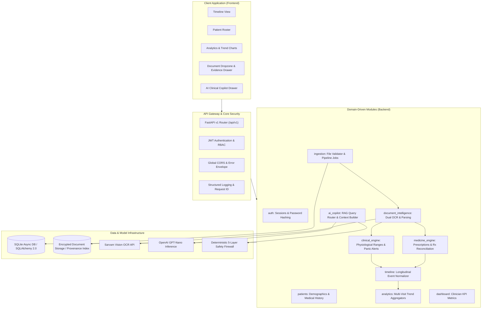
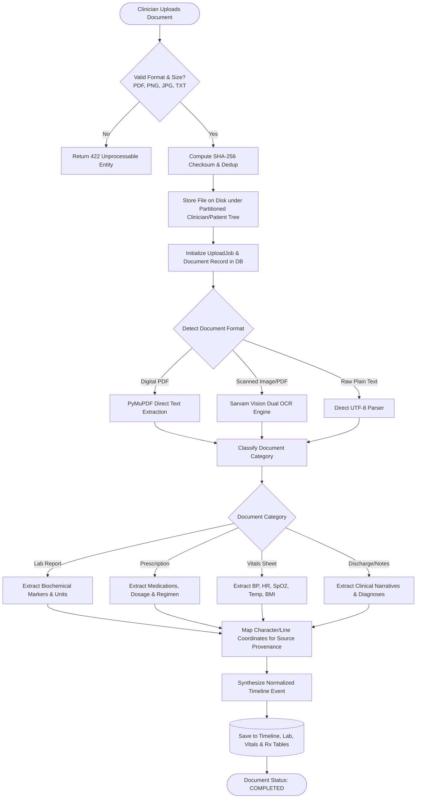
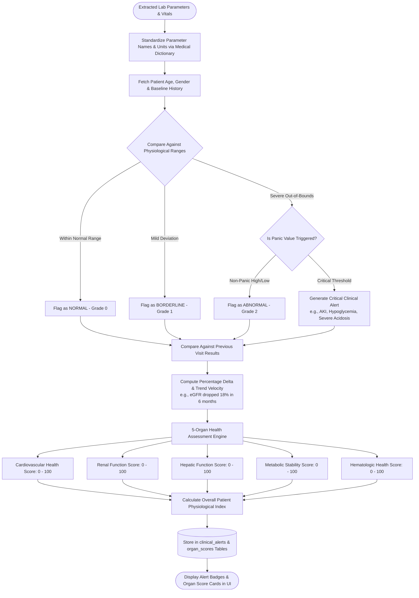
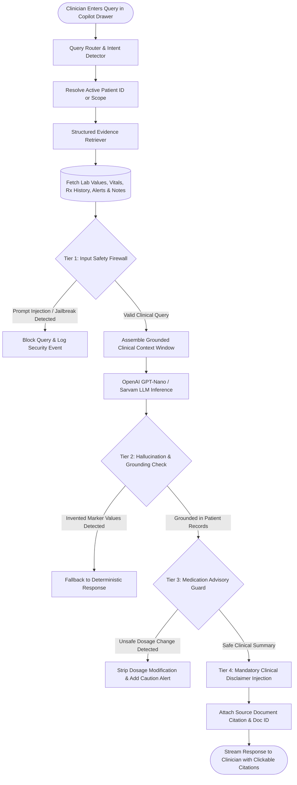

# 🏥 Swasthya — Enterprise Clinical Intelligence & Longitudinal Patient Timeline Platform

<div align="center">

### *One Timeline. Every Record. Smarter Clinical Decisions.*

[](https://python.org)
[](https://fastapi.tiangolo.com)
[](https://react.dev)
[](https://typescriptlang.org)
[](https://tailwindcss.com)
[](https://www.sqlalchemy.org)
[](https://openai.com)
[](LICENSE)

---

**[🏗️ Architecture](#️-system-architecture)** • **[🔄 Flowcharts](#-end-to-end-workflow-flowcharts)** • **[✨ Key Features](#-key-platform-features)** • **[🫀 5-Organ Clinical Scoring](#-5-organ-system-clinical-intelligence)** • **[🛡️ AI Copilot & Safety Firewall](#%EF%B8%8F-grounded-ai-copilot--safety-firewall)** • **[🚀 Quick Start](#-quick-start--installation-guide)** • **[📡 API Spec](#-api-endpoint-reference)**

</div>

---

## 📌 Table of Contents

1. [Executive Overview](#-executive-overview)
2. [Problem Statement & Solution](#-problem-statement--solution)
3. [🏗️ System Architecture](#️-system-architecture)
   - [High-Level Architectural Model](#high-level-architectural-model)
   - [Layered DDD Architecture Diagram](#layered-ddd-architecture-diagram)
4. [🔄 End-to-End Workflow Flowcharts](#-end-to-end-workflow-flowcharts)
   - [Flowchart 1: Document Ingestion, Dual OCR & Entity Extraction](#flowchart-1-document-ingestion-dual-ocr--entity-extraction)
   - [Flowchart 2: Deterministic Clinical Intelligence & Organ Scoring](#flowchart-2-deterministic-clinical-intelligence--organ-scoring)
   - [Flowchart 3: Grounded AI Copilot & 4-Tier Safety Firewall](#flowchart-3-grounded-ai-copilot--4-tier-safety-firewall)
5. [✨ Key Platform Features](#-key-platform-features)
   - [1. Longitudinal Patient Event Timeline](#1-longitudinal-patient-event-timeline)
   - [2. Multi-Format Ingestion & Source Evidence Drawer](#2-multi-format-ingestion--source-evidence-drawer)
   - [3. Deterministic Clinical Engine & Panic Alerts](#3-deterministic-clinical-engine--panic-alerts)
   - [4. Medicine Intelligence & Prescription Tracker](#4-medicine-intelligence--prescription-tracker)
   - [5. Grounded AI Copilot & Natural Language Querying](#5-grounded-ai-copilot--natural-language-querying)
   - [6. Clinician Analytics & Longitudinal Trends](#6-clinician-analytics--longitudinal-trends)
   - [7. Enterprise Security, RBAC & Observability](#7-enterprise-security-rbac--observability)
6. [🫀 5-Organ System Clinical Intelligence](#-5-organ-system-clinical-intelligence)
7. [🛡️ Grounded AI Copilot & Safety Firewall](#%EF%B8%8F-grounded-ai-copilot--safety-firewall)
8. [🛠️ Technology Stack](#️-technology-stack)
9. [📁 Codebase Directory Structure](#-codebase-directory-structure)
10. [🚀 Quick Start & Installation Guide](#-quick-start--installation-guide)
11. [🌱 Synthetic Patient Seeder](#-synthetic-patient-seeder)
12. [📡 API Endpoint Reference](#-api-endpoint-reference)
13. [📄 License & Authors](#-license--authors)

---

## 💡 Executive Overview

**Swasthya** is a next-generation **Clinical Intelligence and Longitudinal Patient Timeline Platform** engineered to address the systemic fragmentation of modern medical healthcare records. In contemporary healthcare environments, patient medical information is siloed across handwritten prescription sheets, diagnostic laboratory PDF reports, emergency department discharge summaries, bedside vitals logs, and clinician progress notes.

Swasthya ingests, normalizes, validates, and correlates disparate clinical artifacts into a **single unified, interactive longitudinal patient timeline**. Powered by a deterministic physiological rules engine and a guarded clinical AI copilot, Swasthya empowers clinicians to identify silent clinical decompensation, detect critical lab anomalies, track organ health trajectories, and query complex medical records with millisecond responsiveness.

---

## 🎯 Problem Statement & Solution

### The Challenge
- **Fragmented Data Silos:** Patients arrive with stacks of paper records, multi-vendor PDF reports, and discontinuous EHR entries.
- **Cognitive Overload:** Physicians have less than 15 minutes per consultation to review multi-year histories, leading to missed abnormal trends (e.g., gradual eGFR decline or subtle HbA1c elevation).
- **Dangerous Hallucinations in Medical AI:** Generic generative AI systems frequently invent diagnostic numbers, produce contradictory medical advice, or hallucinate drug dosages.
- **Lack of Clinical Provenance:** Clinicians cannot trust extracted digital data without being able to verify the exact physical document source.

### The Swasthya Solution
1. **Multi-Category Ingestion Pipeline:** Automated ingestion of Lab Reports, Vitals Sheets, Prescriptions, Discharge Summaries, and Clinical Notes.
2. **Dual OCR & Provenance Mapping:** Hybrid OCR combining Sarvam Vision API with PyMuPDF/Tesseract, maintaining character-level bounding box provenance.
3. **Deterministic Clinical Scoring:** Zero-hallucination, evidence-based normal range validation and 5-Organ System health scoring (Cardiovascular, Renal, Hepatic, Metabolic, Hematologic).
4. **Source Evidence Drawer:** Click any lab marker on the timeline to instantly open the raw document snippet and highlight the exact extraction source.
5. **Grounded AI Copilot with 4-Tier Safety Firewall:** Strict RAG assistant that refuses speculative medical diagnoses, rejects prompt injection attacks, and provides verifiable citations.

---

## 🏗️ System Architecture

### High-Level Architectural Model

Swasthya adheres strictly to **Clean Architecture** and **Domain-Driven Design (DDD)** principles. The codebase enforces inward dependency flows, modular bounded contexts, and explicit separation between domain logic, persistence, and external presentation.

```
┌─────────────────────────────────────────────────────────────────────────────┐
│                            PRESENTATION LAYER                               │
│      React 18 · TypeScript · Vite · TailwindCSS 3 · Radix UI · Recharts     │
└──────────────────────────────────────┬──────────────────────────────────────┘
                                       │ HTTPS / JSON REST
┌──────────────────────────────────────▼──────────────────────────────────────┐
│                        API GATEWAY & MIDDLEWARE LAYER                       │
│    FastAPI 0.111 · CORS · Request ID Tracking · Structlog · Global Handlers │
└──────────────────────────────────────┬──────────────────────────────────────┘
                                       │ Dependency Injection
┌──────────────────────────────────────▼──────────────────────────────────────┐
│                    DOMAIN-DRIVEN BUSINESS MODULES (DDD)                     │
│  ┌──────────────┐  ┌──────────────┐  ┌──────────────┐  ┌─────────────────┐  │
│  │     auth     │  │   patients   │  │  ingestion   │  │  doc_intel      │  │
│  └──────────────┘  └──────────────┘  └──────────────┘  └─────────────────┘  │
│  ┌──────────────┐  ┌──────────────┐  ┌──────────────┐  ┌─────────────────┐  │
│  │  clinical_eng│  │  medicine_eng│  │   timeline   │  │   ai_copilot    │  │
│  └──────────────┘  └──────────────┘  └──────────────┘  └─────────────────┘  │
│  ┌──────────────┐  ┌──────────────┐                                         │
│  │  analytics   │  │  dashboard   │                                         │
│  └──────────────┘  └──────────────┘                                         │
└──────────────────────────────────────┬──────────────────────────────────────┘
                                       │
         ┌─────────────────────────────┴─────────────────────────────┐
         ▼                                                           ▼
┌────────────────────────────────┐         ┌────────────────────────────────┐
│      PERSISTENCE & STORAGE     │         │      AI & OCR FOUNDATION       │
│  SQLAlchemy 2.0 Async Engine   │         │  Dual OCR (Sarvam + PyMuPDF)   │
│  aiosqlite · SQLite3 Database  │         │  OpenAI GPT / Sarvam 105B      │
│  Partitioned Document Storage  │         │  Multi-Layer Safety Firewall   │
└────────────────────────────────┘         └────────────────────────────────┘
```

### Layered DDD Architecture Diagram



---

## 🔄 End-to-End Workflow Flowcharts

### Flowchart 1: Document Ingestion, Dual OCR & Entity Extraction



---

### Flowchart 2: Deterministic Clinical Intelligence & Organ Scoring



---

### Flowchart 3: Grounded AI Copilot & 4-Tier Safety Firewall



---

## ✨ Key Platform Features

### 1. Longitudinal Patient Event Timeline
- **Unified Clinical Stream:** Blends 5 distinct clinical record types into an interactive chronological timeline:
  - 🧪 **Lab Reports:** Biochemical, hematological, and metabolic lab panels.
  - 🩺 **Vitals Sheets:** Blood pressure, heart rate, oxygen saturation, temperature, respiratory rate, BMI.
  - 💊 **Prescriptions:** Drug brand, generic name, dosage, route, frequency, and duration.
  - 📋 **Discharge Summaries:** Inpatient admission causes, hospital procedures, and discharge conditions.
  - 📝 **Clinical Notes:** Physician observations, chief complaints, and care recommendations.
- **Visual Severity Badging:** Events color-coded by clinical urgency (`NORMAL` green, `BORDERLINE` amber, `CRITICAL` red).
- **Interactive Temporal Filtering:** Filter by date ranges (3 Months, 6 Months, 1 Year, 3 Years, All-Time) and event categories.

### 2. Multi-Format Ingestion & Source Evidence Drawer
- **Drag-and-Drop Batch Ingestion:** Process multi-page PDFs, scans, camera captures, and plain text medical files simultaneously.
- **Dual OCR Engine:** Intelligently routes high-resolution digital text via PyMuPDF and complex scanned imagery via Sarvam Vision OCR.
- **Source Evidence Drawer:** Every extracted numeric result, diagnosis, and prescription maintains a cryptographic citation to its source document ID, page number, and snippet coordinates. Clicking an item on the timeline instantly opens the original document highlight.

### 3. Deterministic Clinical Engine & Panic Alerts
- **Age- and Gender-Specific Reference Ranges:** Lab values are evaluated against codified clinical standards rather than arbitrary hardcoded limits.
- **Automated Panic Value Detection:** Immediately alerts physicians to acute life-threatening emergencies (e.g., Serum Potassium > 6.0 mmol/L, Platelets < 20,000 /uL, Fasting Blood Glucose > 350 mg/dL).
- **Longitudinal Trend Detection:** Identifies insidious multi-visit trajectories (e.g., eGFR decline > 10% over 6 months indicating chronic kidney disease progression).

### 4. Medicine Intelligence & Prescription Tracker
- **Prescription Extraction & Parsing:** Automatically identifies drug names, strengths (e.g., 500 mg), formulations (Tablet, Capsule, Syrup), and dosage regimens (e.g., BD, TDS, Once Daily).
- **Active vs. Historical Drug Roster:** Differentiates between currently active regimens and previously discontinued therapies.
- **Prescription Timeline Alignment:** Correlates medication starts and stops directly against laboratory parameter swings (e.g., Statin introduction correlated with LDL reduction).

### 5. Grounded AI Copilot & Natural Language Querying
- **Context-Aware Medical Assistant:** Allows clinicians to ask natural language questions regarding any patient's longitudinal history (e.g., *"Has this patient's kidney function declined over the last 12 months?"* or *"What was the HbA1c trajectory since initiating Metformin?"*).
- **Strict Grounding:** The assistant generates responses derived solely from verified records stored in the patient's timeline.
- **Clickable Provenance Citations:** Answers include clickable badges that spotlight the underlying laboratory report or physician note.

### 6. Clinician Analytics & Longitudinal Trends
- **Multi-Metric Interactive Trend Charts:** Built with Recharts, visualizing parameters over time (HbA1c, Serum Creatinine, eGFR, Blood Pressure, AST/ALT, Lipid Profile).
- **Patient Population Stratification:** Categorizes patients into risk tiers (Low Risk, Moderate Risk, High Risk Decompensating).
- **Executive Clinical Dashboard:** Provides clinician workload summaries, pending review queues, and urgent alert tickers.

### 7. Enterprise Security, RBAC & Observability
- **JSON Web Token (JWT) Authentication:** Industry-standard OAuth2 password flow with bcrypt password encryption.
- **Role-Based Access Control (RBAC):** Separate permissions for Clinicians, Laboratory Specialists, and Administrative Staff.
- **Structured Observability:** Integrated `structlog` logging with unique `X-Request-ID` correlation headers across all HTTP requests.
- **Standardized API Error Envelope:** Uniform error responses across all endpoints with machine-readable error codes.

---

## 🫀 5-Organ System Clinical Intelligence

Swasthya computes deterministic, evidence-backed organ health scores (scale **0 to 100**, where 100 represents optimal physiological function) across 5 core vital systems:

| Organ System | Key Biomarkers & Clinical Parameters Evaluated | Warning Thresholds & High-Risk Indicators |
| :--- | :--- | :--- |
| **Cardiovascular** | Systolic/Diastolic BP, Heart Rate, Total Cholesterol, LDL, HDL, Triglycerides, hs-CRP | SBP > 160 mmHg, DBP > 100 mmHg, LDL > 190 mg/dL |
| **Renal** | Serum Creatinine, Blood Urea Nitrogen (BUN), eGFR, Uric Acid, Urine Albumin | Creatinine > 2.0 mg/dL, eGFR < 60 mL/min/1.73m² |
| **Hepatic** | SGPT (ALT), SGOT (AST), Total Bilirubin, Direct Bilirubin, Alkaline Phosphatase (ALP) | ALT/AST > 3x ULN, Total Bilirubin > 2.5 mg/dL |
| **Metabolic** | Fasting Blood Sugar, Postprandial Glucose, HbA1c, Body Mass Index (BMI) | HbA1c > 8.5%, Fasting Glucose > 200 mg/dL |
| **Hematologic** | Hemoglobin, Total Leukocyte Count (WBC), Platelet Count, Hematocrit (PCV), ESR | Platelets < 50,000 /uL, WBC > 15,000 /uL, Hb < 8.0 g/dL |

---

## 🛡️ Grounded AI Copilot & Safety Firewall

Swasthya deploys a **4-Tier Safety & Compliance Firewall** that wraps all generative AI interactions to guarantee clinical safety and prevent automated harm:

```
                  ┌─────────────────────────────────────┐
                  │       Clinician Input Query         │
                  └──────────────────┬──────────────────┘
                                     │
                                     ▼
        [Tier 1] ──► 🛡️ Input Sanitizer & Jailbreak Firewall
                     • Blocks prompt injections & instruction override attacks
                     • Rejects non-medical and irrelevant conversational queries
                                     │
                                     ▼
        [Tier 2] ──► 📚 Grounded Context Assembly (RAG)
                     • Strictly retrieves validated records from patient database
                     • Prevents cross-patient information leakage
                                     │
                                     ▼
        [Tier 3] ──► 🧠 LLM Inference Engine (OpenAI / Sarvam)
                     • Synthesizes grounded observations with exact citations
                                     │
                                     ▼
        [Tier 4] ──► ⚖️ Output Verification & Compliance Enforcement
                     • Intercepts and suppresses unauthorized dosage adjustments
                     • Verifies all quoted numbers match retrieved database facts
                     • Appends mandatory clinical advisory disclaimer
                                     │
                                     ▼
                  ┌─────────────────────────────────────┐
                  │    Verified Output with Citations   │
                  └─────────────────────────────────────┘
```

---

## 🛠️ Technology Stack

### Backend
- **Framework:** FastAPI 0.111.0 (Async High-Performance Python Web Framework)
- **Runtime:** Python 3.11+
- **ORM / Database:** SQLAlchemy 2.0 (Async) with SQLite3 (`aiosqlite`)
- **Data Validation:** Pydantic v2 & Pydantic-Settings
- **Authentication:** Python-Jose (JWT Tokens) & Passlib (Bcrypt)
- **OCR Engines:** Sarvam Vision OCR API & PyMuPDF (fitz)
- **AI / LLM Integration:** OpenAI API (GPT-Nano) & Sarvam LLM
- **Observability:** Structlog (Structured JSON Logging)

### Frontend
- **Framework:** React 18
- **Build Tool:** Vite 5
- **Language:** TypeScript 5.x (Strict Typing)
- **Styling:** TailwindCSS 3 & PostCSS
- **Component Library:** Radix UI Primitives & Lucide React
- **Animations:** Framer Motion
- **Data Visualization:** Recharts (Interactive Clinical Charts)
- **HTTP Client:** Axios with Request Interceptors & Error Envelopes

---

## 📁 Codebase Directory Structure

```text
Swasthya/
├── backend/
│   ├── app/
│   │   ├── api/v1/                   # Versioned REST API Router Gateway
│   │   ├── core/
│   │   │   ├── config/settings.py    # Pydantic Settings & Environment Loading
│   │   │   ├── security.py           # JWT Creation, Password Hashing (Bcrypt)
│   │   │   ├── dependencies.py       # FastAPI DB Session & User Auth Dependencies
│   │   │   └── exceptions.py         # Domain Exception Hierarchy
│   │   ├── database/
│   │   │   ├── session.py            # Async Engine & SessionMaker
│   │   │   ├── base.py               # Declarative SQLAlchemy Base Model
│   │   │   └── init_db.py            # Database Table Creation
│   │   ├── modules/                  # DDD Self-Contained Domain Modules
│   │   │   ├── auth/                 # Login, Registration, JWT Tokens
│   │   │   ├── patients/             # Patient CRUD, Demographics
│   │   │   ├── ingestion/            # File Uploads, Partitioned Storage
│   │   │   ├── document_intelligence/# Dual OCR, Medical Entity Parsing
│   │   │   ├── clinical_engine/      # Physiological Ranges, Organ Scoring
│   │   │   ├── medicine_engine/      # Prescription Parsing, Drug Reconciliation
│   │   │   ├── timeline/             # Longitudinal Timeline Aggregator
│   │   │   ├── ai_copilot/           # RAG Query Router, Context Builder
│   │   │   ├── analytics/            # Multi-Visit Trend Analytics
│   │   │   └── dashboard/            # Clinician Workstation KPI Metrics
│   │   ├── ai/                       # AI Pipeline, Guardrails & LLM Clients
│   │   ├── shared/                   # Middlewares (CORS, Error Handlers)
│   │   └── observability/            # Structlog Structured Logger
│   ├── scripts/
│   │   ├── seed_demo_patients.py     # 24-Month Longitudinal Patient Seeder
│   │   └── clear_demo_patients.py    # Synthetic Patient Reset Utility
│   ├── storage/uploads/              # Partitioned Physical Document Storage
│   ├── requirements.txt              # Production Dependencies
│   └── pyproject.toml                # Project & Tooling Metadata
│
├── frontend/
│   ├── src/
│   │   ├── components/               # Shared UI & Layout Components
│   │   ├── contexts/                 # React Contexts (Auth, Global, UI)
│   │   ├── features/                 # Modular Feature Pages
│   │   │   ├── auth/                 # Login, Registration Screens
│   │   │   ├── dashboard/            # Clinician Command Center
│   │   │   ├── patients/             # Patient Directory & Profiles
│   │   │   ├── timeline/             # Longitudinal Interactive Timeline
│   │   │   ├── ingestion/            # Upload Dropzone, Source Evidence Drawer
│   │   │   ├── clinical/             # Organ Score Cards, Alert Panels
│   │   │   ├── analytics/            # Longitudinal Trend Graph Views
│   │   │   └── assistant/            # AI Copilot Drawer & Chat Assistant
│   │   ├── services/api/             # Axios Client & API Endpoints
│   │   ├── theme/                    # Color Palettes, Design Tokens
│   │   └── utils/                    # Route Constants, Date Formatters
│   ├── package.json                  # Frontend NPM Dependencies
│   ├── vite.config.ts                # Vite Configuration & Proxy Rules
│   └── tailwind.config.ts            # Tailwind Design Configuration
│
└── README.md                         # Comprehensive System Specification
```

---

## 🚀 Quick Start & Installation Guide

### Prerequisites
- **Python:** 3.11 or higher
- **Node.js:** 18.x or higher
- **Package Manager:** npm or yarn

---

### Step 1: Clone the Repository
```bash
git clone https://github.com/ishwaribhoyar/Swasthya.git
cd Swasthya
```

---

### Step 2: Backend Setup
```bash
cd backend

# Create and activate Python virtual environment
python -m venv venv

# Windows (Command Prompt / PowerShell):
venv\Scripts\activate

# macOS / Linux:
source venv/bin/activate

# Install dependencies
pip install -r requirements.txt

# Configure Environment Variables
copy .env.example .env     # Windows
cp .env.example .env       # macOS / Linux
```

Edit `.env` and provide your configuration:
```env
APP_NAME=Swasthya
VERSION=0.1.0
DEBUG=True
SECRET_KEY=your_secure_random_jwt_secret_key_min_32_chars
DATABASE_URL=sqlite+aiosqlite:///./swasthya.db
CORS_ORIGINS=http://localhost:3000,http://localhost:5173
SARVAM_API_KEY=your_optional_sarvam_api_key
OPENAI_API_KEY=your_optional_openai_api_key
```

Run database initialization and start the backend server:
```bash
uvicorn app.main:create_app --factory --reload --host 0.0.0.0 --port 8000
```
- **Backend API:** `http://localhost:8000`
- **Interactive Swagger Docs:** `http://localhost:8000/docs`
- **ReDoc Documentation:** `http://localhost:8000/redoc`

---

### Step 3: Frontend Setup
In a new terminal window:
```bash
cd frontend

# Install dependencies
npm install

# Start Vite development server
npm run dev
```
- **Frontend Application:** `http://localhost:5173` (or `http://localhost:3000`)

---

## 🌱 Synthetic Patient Seeder

Swasthya includes a clinical dataset generator that simulates realistic longitudinal medical histories spanning **24 months** across multiple visits for testing and clinical demonstration:

1. **Arjun Mehta (Patient 1):** Stable Type-2 Diabetes Mellitus under regular Metformin therapy with well-controlled organ scores.
2. **Priya Sharma (Patient 2):** Progressive High-Risk Hypertension and emerging Diabetic Nephropathy showing acute eGFR decline and clinical alerts.

To seed the synthetic records into your local database:
```bash
cd backend
python scripts/seed_demo_patients.py
```

To wipe synthetic patients without affecting production clinician accounts:
```bash
python scripts/seed_demo_patients.py --reset
# or
python scripts/clear_demo_patients.py
```

---

## 📡 API Endpoint Reference

| HTTP Method | Endpoint | Description | Auth Required |
| :--- | :--- | :--- | :---: |
| `POST` | `/api/v1/auth/register` | Register new clinician user account | No |
| `POST` | `/api/v1/auth/login` | Authenticate clinician and issue JWT token | No |
| `GET` | `/api/v1/auth/me` | Fetch authenticated clinician profile | Yes |
| `GET` | `/api/v1/patients/` | List all patients under clinician roster | Yes |
| `POST` | `/api/v1/patients/` | Register new patient record | Yes |
| `GET` | `/api/v1/patients/{id}` | Retrieve patient demographics & summary | Yes |
| `POST` | `/api/v1/ingestion/upload` | Upload multi-format clinical document | Yes |
| `GET` | `/api/v1/ingestion/jobs/{id}` | Check async ingestion job status | Yes |
| `GET` | `/api/v1/timeline/{patient_id}` | Fetch consolidated longitudinal timeline | Yes |
| `GET` | `/api/v1/clinical/alerts/{patient_id}` | Fetch active physiological panic alerts | Yes |
| `GET` | `/api/v1/clinical/organ-scores/{patient_id}` | Retrieve 5-Organ System scores (0-100) | Yes |
| `POST` | `/api/v1/copilot/chat` | Send grounded natural language query to AI Copilot | Yes |
| `GET` | `/api/v1/analytics/trends/{patient_id}` | Get multi-visit quantitative marker trends | Yes |
| `GET` | `/api/v1/dashboard/metrics` | Retrieve clinician command center metrics | Yes |

---

## 📄 License & Authors

This project is licensed under the **MIT License** — see the [LICENSE](LICENSE) file for details.

Developed with ❤️ for advancing clinical decision support, diagnostic precision, and physician workflow efficiency.
